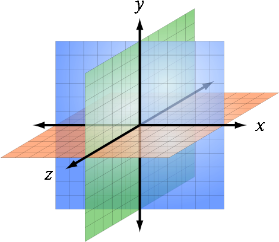

<h1 align="center">00 Koordinatsystemer</h1>

  

Denne session er tilrettelagt som selvstudie. Jeg har vurderet at det ligge så tæt på gymnasieniveau, at det er noget I selv kan arbejde med. Jeg forudsætter at I kan matematik på gymnasieniveau, og at I har arbejdet med koordinatsystemer før. Hvis I har brug for en opfriskning, kan I læse [kapitel 1](https://viaucdk-my.sharepoint.com/:b:/g/personal/rib_viauc_dk/EcdahK3g3eROhhGCoh_fS1MBEWnKVWLrlw0vGmTlw8kpjw?e=WCdU7S) i bogen eller læse de [udvidede noter](#udvidede-noter).

### Kort om sessionen

Denne session introducerer kartesiske koordinatsystemer, som er fundamentale for lineær algebra og 3D-matematik. Der gennemgås 1D, 2D og 3D koordinatsystemer med fokus på hvordan punkter kan lokaliseres i rummet, samt forskellen mellem venstre- og højrehåndede systemer. Emnet dækker desuden repræsentationen af afstande og vinkler i 3D-rum.

#### Nøgleord
- Kartesiske koordinater
- 2D koordinatsystemer
- 3D koordinatsystemer
- Venstre- og højrehåndede systemer
- Trigonometriske funktioner
- Lokalisering af punkter

### Uddybende noter

#### Introduktion
Et kartesisk koordinatsystem bruges til at præcist beskrive positioner, afstande og vinkler i rummet. Systemet blev opfundet af René Descartes og har været fundamentet for moderne matematik, særligt inden for geometri og algebra.

#### 1D Matematik
- En talelinje repræsenterer naturlige tal, hele tal og rationelle tal.
- Rationelle tal er brøker, mens reelle tal inkluderer irrationelle tal som $\pi$.
- Talelinjen giver en intuitiv visualisering af tallene i deres "naturlige rækkefølge".

#### 2D Kartesiske Koordinatsystemer
- Et 2D-koordinatsystem består af:
  - En oprindelse (0,0), der fungerer som referencepunkt.
  - To akser, $x$ og $y$, der er ortogonale (90 grader på hinanden).
- Placeringen af et punkt specificeres med $(x, y)$, hvor $x$ angiver afstanden til $y$-aksen, og $y$ angiver afstanden til $x$-aksen.
- 2D-rummet kan udvides uendeligt i alle retninger.

#### 3D Kartesiske Koordinatsystemer
- Tilføjelse af en tredje akse, $z$, udvider systemet til 3D.
- Punkter specificeres nu med $(x, y, z)$.
- 3D-rummet kan have venstre- eller højrehåndede koordinatsystemer:
  - Venstrehåndet: Tommel = $+x$, Pegefinger = $+y$, Langfinger = $+z$.
  - Højrehåndet: Tommel = $+x$, Pegefinger = $+y$, Langfinger = $-z$.
- Rotationsregler afhænger af systemet: venstrehåndede systemer har positiv rotation med urets retning.

#### Konventioner i Matematiske Beregninger
- Brug af kontinuerte tal (som $\pi$) er praktisk i teoretiske beregninger, selvom computere arbejder med diskrete tal.
- Summationsnotation ($\Sigma$) og produktnotation ($\Pi$) bruges som komprimerede måder at repræsentere gentagne summer og produkter.

#### Trigonometriske Funktioner
- Sinus ($\sin$), cosinus ($\cos$) og tangens ($\tan$) defineres på enhedscirklen.
- Identiteter som $\sin^2\theta + \cos^2\theta = 1$ danner basis for videre analyse.

#### Praktisk Anvendelse
Man bruger disse begreber for simulationer og rendering af 3D-verdener i computerspil. Forståelsen af kartesiske systemer muliggør præcise beregninger og manipulation af objekter i rummet.

