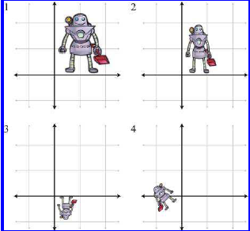

<h1 align="center">Introduktion til matricer</h1>

    <video class="custom-video" width="600" autoplay loop muted>
        <source src="../figures/video_preview3_h264.mp4" type="video/mp4">
        Your browser does not support the video tag.
    </video>

## Forberedelse
3DM: [Kapitel 4](https://viaucdk-my.sharepoint.com/:b:/g/personal/rib_viauc_dk/EZiHg82zupNHsWtESkXgkqYB8kFhPbPATkLkZ9xbVMEu2Q?e=FxzKmq)

I skal have set [videoerne](#videomateriale) fra den aktuelle session. Dette udgør som minimum jeres forberedelse til hver session. Hertil kan I også læse i bogen.

## Materiale

[Sessionsmateriale](https://viaucdk-my.sharepoint.com/:f:/g/personal/rib_viauc_dk/Et2l1Ih6uu5Os-few3a3EXUBjHFQeS9wVjGBZmRnYWj8TA?e=LcwbJ7)

[Øvelsesnoter - tilgængelige mandag]()

---

## Kort om sessionen
I denne session skal vi arbejde med **matricer** – et grundlæggende værktøj i matematikken, som blandt andet bruges til at løse **lineære ligninger** - og vi skal se, hvordan vi kan svare på nogle af sidste uges emner vha. matricer. Vi ser på, hvordan **kvadratiske matricer** fungerer, og hvad de kan bruges til.  

Vi gennemgår også **transponering** og centrale **matrixoperationer**, som spiller en vigtig rolle i mange matematiske og tekniske anvendelser. Til sidst kigger vi på, hvordan matricer fortolkes geometrisk, et emne vi udfolder i næste uge.

Målet med sessionen er at give jer en intuitiv forståelse af, hvordan matricer fungerer, og hvordan de anvendes i praksis.

### Nøgleord
- Matricer
- Ligningssystemer
- Kvadratiske matricer
- Transponering
- Matrix operationer
- Echelon former
- Gauss elimination
- Lineær uafhængighed
- Ortogonalitet - igen
---

## Videomateriale

Alt materiale til videoerne er i [Sessionsmaterialet](https://viaucdk-my.sharepoint.com/:f:/g/personal/rib_viauc_dk/Et2l1Ih6uu5Os-few3a3EXUBjHFQeS9wVjGBZmRnYWj8TA?e=LcwbJ7)

### 3.1. Introduktion til matricer

<iframe width="560" height="315" src="https://www.youtube.com/embed/OIKdJ_gOrP0?si=xEoDU4k5vxdABub0" title="YouTube video player" frameborder="0" allow="accelerometer; autoplay; clipboard-write; encrypted-media; gyroscope; picture-in-picture; web-share" referrerpolicy="strict-origin-when-cross-origin" allowfullscreen></iframe>

### 3.2. Typer af matricer

<iframe width="560" height="315" src="https://www.youtube.com/embed/YuQGuWijtyU?si=0zuZ6EIDoiWYk8cF" title="YouTube video player" frameborder="0" allow="accelerometer; autoplay; clipboard-write; encrypted-media; gyroscope; picture-in-picture; web-share" referrerpolicy="strict-origin-when-cross-origin" allowfullscreen></iframe>

### 3.3. Matrixoperationer

<iframe width="560" height="315" src="https://www.youtube.com/embed/0fKJZwus0Iw?si=djRTrC0REAIdbRTk" title="YouTube video player" frameborder="0" allow="accelerometer; autoplay; clipboard-write; encrypted-media; gyroscope; picture-in-picture; web-share" referrerpolicy="strict-origin-when-cross-origin" allowfullscreen></iframe>

### 3.4. Rækkereduktion og anvendelser

<iframe width="560" height="315" src="https://www.youtube.com/embed/an5jbSTmWeQ?si=8MM2et0L28sWjB9m" title="YouTube video player" frameborder="0" allow="accelerometer; autoplay; clipboard-write; encrypted-media; gyroscope; picture-in-picture; web-share" referrerpolicy="strict-origin-when-cross-origin" allowfullscreen></iframe>

### 3.5. Lineære transformationer

<iframe width="560" height="315" src="https://www.youtube.com/embed/XuPODmA_GkA?si=_vh5I8i8ZrrDgjMO" title="YouTube video player" frameborder="0" allow="accelerometer; autoplay; clipboard-write; encrypted-media; gyroscope; picture-in-picture; web-share" referrerpolicy="strict-origin-when-cross-origin" allowfullscreen></iframe>

---

## Øvelser

---

**Øvelse 1**

Lav Øvelse 7 fra sidste uge

??? answer "Se svaret"
    
    Se svaret i opgaven fra sidste uge.

---

**Øvelse 2**

Lav øvelse 4.b., 5.c. og 6.d. fra sidste uge.

??? answer "Se svaret"
    Du skal bruge Sympy til at løse opgaverne. Se løsningerne i opgaven fra sidste uge. I 4.a. skal du række reducere matricen og tjekke om der er frie variable. I 5.c. skal du række reducere kovariansmatricen og tjekke om der kun er værdier på diagonalen. I 6.d. skal du også reducere kovariansmatricen og tjekke om der kun er værdier på diagonalen og om disse værdier er 1 (eller cirka 1).
    

---

Brug følgende matricer til spørgsmål 3-5 og lav disse øvelser "i hånden" (dvs. uden brug af Python):

$$
\begin{aligned}
\mathbf{A} &= \begin{bmatrix} 
13 & 4  & -8  \\ 
12 & 0  & 6   \\ 
-3 & -1 & 5   \\ 
10 & -2 & 5  
\end{bmatrix}, &
\mathbf{B} &= \begin{bmatrix} 
k_x & 0   & 0   \\  
0   & k_y & 0   \\  
0   & 0   & k_z 
\end{bmatrix}, &
\mathbf{C} &= \begin{bmatrix} 
15  & 8  \\  
-7  & 3  
\end{bmatrix}, \\  
\mathbf{D} &= \begin{bmatrix} 
a & g \\  
b & h \\  
c & i \\  
d & j \\  
f & k 
\end{bmatrix}, &
\mathbf{E} &= \begin{bmatrix} 
0 & 1 & 3 
\end{bmatrix}, &
\mathbf{F} &= \begin{bmatrix} 
x \\  
y \\  
z \\  
w 
\end{bmatrix}, \\  
\mathbf{G} &= \begin{bmatrix} 
10 & 20 & 30 \\  
1  &    &    
\end{bmatrix}. 
\end{aligned}
$$

---

**Exercise 3**

For hver matrix, angiv dimensionerne for matricen og identificér, om den er kvadratisk og/eller diagonal.

??? answer "Se svaret"
    Se tabellen nedenfor.

    \[
    \begin{aligned}
    &\begin{array}{c|c|l|l}
    \text { Matrix } & \text { Række } \times \text { Søjle } & \text { Kvadratisk } & \text { Diagonal } \\
    \hline \text { A } & 4 \times 3 & \text { No } & \text { No } \\
    \mathbf{B} & 3 \times 3 & \text { Yes } & \text { Yes } \\
    \mathbf{C} & 2 \times 2 & \text { Yes } & \text { No } \\
    \text { D } & 5 \times 2 & \text { No } & \text { No } \\
    \text { E } & 1 \times 3 & \text { No } & \text { No } \\
    \mathbf{F} & 4 \times 1 & \text { No } & \text { No } \\
    \mathbf{G} & 1 \times 4 & \text { No } & \text { No } \\
    \mathbf{H} & 3 \times 1 & \text { No } & \text { No }
    \end{array}
    \end{aligned}
    \]

---

**Øvelse 4**

Transponér matricerne $\mathbf{A}$, $\mathbf{C}$, $\mathbf{D}$, $\mathbf{F}$ og $\mathbf{G}$.

??? answer "Se svaret"
    $\begin{aligned}
    & \mathbf{A}^{\mathbf{T}}=\left[\begin{array}{ccc}
    13 & 4 & -8 \\
    12 & 0 & 6 \\
    -3 & -1 & 5 \\
    10 & -2 & 5
    \end{array}\right]^{\mathbf{T}}=\left[\begin{array}{cccc}
    13 & 12 & -3 & 10 \\
    4 & 0 & -1 & -2 \\
    -8 & 6 & 5 & 5
    \end{array}\right] \\
    & \mathbf{B}^{\mathrm{T}}=\left[\begin{array}{ccc}
    k_x & 0 & 0 \\
    0 & k_y & 0 \\
    0 & 0 & k_z
    \end{array}\right]^{\mathrm{T}}=\left[\begin{array}{ccc}
    k_x & 0 & 0 \\
    0 & k_y & 0 \\
    0 & 0 & k_z
    \end{array}\right] \\
    & \mathbf{C}^{\mathrm{T}}=\left[\begin{array}{cc}
    15 & 8 \\
    -7 & 3
    \end{array}\right]^{\mathrm{T}}=\left[\begin{array}{cc}
    15 & -7 \\
    8 & 3
    \end{array}\right] \quad \mathbf{D}^{\mathrm{T}}=\left[\begin{array}{ll}
    a & g \\
    b & h \\
    c & i \\
    d & j \\
    f & k
    \end{array}\right]^{\mathrm{T}}=\left[\begin{array}{lllll}
    a & b & c & d & f \\
    g & h & i & j & k
    \end{array}\right] \\
    & \mathbf{E}^{\mathrm{T}}=\left[\begin{array}{lll}
    0 & 1 & 3
    \end{array}\right]^{\mathrm{T}}=\left[\begin{array}{l}
    0 \\
    1 \\
    3
    \end{array}\right] \quad \mathbf{F}^{\mathrm{T}}=\left[\begin{array}{c}
    x \\
    y \\
    z \\
    w
    \end{array}\right]^{\mathrm{T}}=\left[\begin{array}{llll}
    x & y & z & w
    \end{array}\right] \\
    & \mathbf{G}^{\mathrm{T}}=\left[\begin{array}{llll}
    10 & 20 & 30 & 1
    \end{array}\right]^{\mathrm{T}}=\left[\begin{array}{c}
    10 \\
    20 \\
    30 \\
    1
    \end{array}\right] \quad \mathbf{H}^{\mathrm{T}}=\left[\begin{array}{c}
    \alpha \\
    \beta \\
    \gamma
    \end{array}\right]^{\mathrm{T}}=\left[\begin{array}{lll}
    \alpha & \beta & \gamma
    \end{array}\right]
    \end{aligned}$

---

**Øvelse 5**

Find alle mulige par af matricer, der kan multipliceres lovligt, og angiv dimensionerne for det resulterende produkt. Inkludér også "par", hvor en matrix multipliceres med sig selv.  (*Hint*: Der er 14 par.)

??? answer "Se svaret"
    \(\begin{array}{rll}\mathbf{A B}=(4 \times 3)(3 \times 3)=4 \times 3 & \mathbf{A H}=(4 \times 3)(3 \times 1)=4 \times 1 \\ \mathbf{B B}=(3 \times 3)(3 \times 3)=3 \times 3 & \mathbf{B H}=(3 \times 3)(3 \times 1)=3 \times 1 \\ \mathbf{C C}=(2 \times 2)(2 \times 2)=2 \times 2 & \text { DC }=(5 \times 2)(2 \times 2)=5 \times 2 \\ \mathbf{E B}=(1 \times 3)(3 \times 3)=1 \times 3 & \mathbf{E H}=(1 \times 3)(3 \times 1)=1 \times 1 \\ \mathbf{F E}=(4 \times 1)(1 \times 3)=4 \times 3 & \mathbf{F G}=(4 \times 1)(1 \times 4)=4 \times 4 \\ \mathbf{G A}=(1 \times 4)(4 \times 3)=1 \times 3 & \mathbf{G F}=(1 \times 4)(4 \times 1)=1 \times 1 \\ \mathbf{H E}=(3 \times 1)(1 \times 3)=3 \times 3 & \mathbf{H G}=(3 \times 1)(1 \times 4)=3 \times 4\end{array}\)
 

---

**Øvelse 6**
Beregn følgende matrixprodukter. Lav også (a) og (d) "i hånden". Du må selv vælge om du vil bruge Sympy eller Numpy til de øvrige opgaver.

1. \(\left[\begin{array}{cc}1 & -2 \\ 5 & 0\end{array}\right]\left[\begin{array}{cc}-3 & 7 \\ 4 & 1 / 3\end{array}\right]\)
2. \(\left[\begin{array}{cc}6 & -7 \\ -4 & 5\end{array}\right]\left[\begin{array}{ll}3 & 3\end{array}\right]\)
3. \(\left[\begin{array}{lll}3 & -1 & 4\end{array}\right]\left[\begin{array}{ccc}-2 & 0 & 3 \\ 5 & 7 & -6 \\ 1 & -4 & 2\end{array}\right]\)
4. \(\left[\begin{array}{llll}x & y & z & w\end{array}\right]\left[\begin{array}{llll}1 & 0 & 0 & 0 \\ 0 & 1 & 0 & 0 \\ 0 & 0 & 1 & 0 \\ 0 & 0 & 0 & 1\end{array}\right]\)
5. \(\left[\begin{array}{llll}7 & -2 & 7 & 3\end{array}\right]\left[\begin{array}{c}-5 \\ 1\end{array}\right]\)
6. \(\left[\begin{array}{ll}3 & 3\end{array}\right]\left[\begin{array}{cc}6 & -7 \\ -4 & 5\end{array}\right]\)

??? answer "Se svaret"

    1. $\begin{aligned}
    {\left[\begin{array}{cc}
    1 & -2 \\
    5 & 0
    \end{array}\right]\left[\begin{array}{cc}
    -3 & 7 \\
    4 & 1 / 3
    \end{array}\right] } & =\left[\begin{array}{cc}
    (1)(-3)+(-2)(4) & (1)(7)+(-2)(1 / 3) \\
    (5)(-3)+(0)(4) & (5)(7)+(0)(1 / 3)
    \end{array}\right] \\
    & =\left[\begin{array}{cc}
    -3+(-8) & 7+(-2 / 3) \\
    -15+0 & 35+0
    \end{array}\right]=\left[\begin{array}{cc}
    -11 & 19 / 3 \\
    -15 & 35
    \end{array}\right]
    \end{aligned}$

    2. Ikke muligt. Kan ikke gange en \(2 \times 2\) matrix med en \(1 \times 2\) vektor fra højre side. 
   
   
    
    3. $\begin{aligned}
    & {\left[\begin{array}{lll}
    3 & -1 & 4
    \end{array}\right]\left[\begin{array}{ccc}
    -2 & 0 & 3 \\
    5 & 7 & -6 \\
    1 & -4 & 2
    \end{array}\right]} \\
    & =\left[\begin{array}{lll}
    (3)(-2)+(-1)(5)+(4)(1) & (3)(0)+(-1)(7)+(4)(-4) & (3)(3)+(-1)(-6)+(4)(2)
    \end{array}\right] \\
    & =\left[\begin{array}{lll}
    -6+(-5)+4 & 0+(-7)+(-16) & 9+6+8
    \end{array}\right]=\left[\begin{array}{lll}
    -7 & -23 & 23
    \end{array}\right]
    \end{aligned}$

    4. \(\left[\begin{array}{llll}x & y & z & w\end{array}\right]\left[\begin{array}{llll}1 & 0 & 0 & 0 \\ 0 & 1 & 0 & 0 \\ 0 & 0 & 1 & 0 \\ 0 & 0 & 0 & 1\end{array}\right]=\left[\begin{array}{llll}x & y & z & w\end{array}\right]\)
    
    5. Ikke muligt. Kan ikke gange en \(1 \times 4\) vektor med en \(2 \times 1\) vektor.

    6. $\begin{aligned}
    {\left[\begin{array}{ll}
    3 & 3
    \end{array}\right]\left[\begin{array}{cc}
    6 & -7 \\
    -4 & 5
    \end{array}\right] } & =\left[\begin{array}{ll}
    (3)(6)+(3)(-4) & (3)(-7)+(3)(5)
    \end{array}\right] \\
    & =\left[\begin{array}{ll}
    18+(-12) & -21+15
    \end{array}\right]=\left[\begin{array}{ll}
    6 & -6
    \end{array}\right]
    \end{aligned}$

    ---

**Øvelse 7**

For hver af de følgende matricer, multiplicér fra venstre med rækkevektoren \([5,-1,2]\).  
Overvej derefter, om multiplikation fra højre med søjlevektoren \([5,-1,2]^{\mathrm{T}}\) vil give det samme eller et andet resultat. Til sidst skal du udføre denne multiplikation for at bekræfte eller korrigere din forventning. Du må selv vælge om du vil bruge Sympy eller Numpy.

1. $\left[\begin{array}{lll}
    1 & 0 & 0 \\
    0 & 1 & 0 \\
    0 & 0 & 1
    \end{array}\right]$

2. \(\left[\begin{array}{ccc}2 & 5 & -3 \\ 1 & 7 & 1 \\ -2 & -1 & 4\end{array}\right]\)

3. \(\left[\begin{array}{ccc}1 & 7 & 2 \\ 7 & 0 & -3 \\ 2 & -3 & -1\end{array}\right]\)
   
    Dette er et eksempel på en symmetrisk matrix. En kvadratisk matrix er symmetrisk, hvis \(\mathbf{A}^{\mathrm{T}}=\mathbf{A}\).
 

4. \(\left[\begin{array}{ccc}0 & -4 & 3 \\ 4 & 0 & -1 \\ -3 & 1 & 0\end{array}\right]\)
   
    Dette er et eksempel på en skæv-symmetrisk eller antisymmetrisk matrix. En kvadratisk matrix er skæv-symmetrisk, hvis \(\mathbf{A}^{\mathrm{T}}=-\mathbf{A}\). Dette indebærer, at de diagonale elementer i en skæv-symmetrisk matrix skal være 0.

??? answer "Se svaret"

    1. Fra venstre: $\left[\begin{array}{lll}5 & -1 & 2\end{array}\right]$. Fra højre: \(=\left[\begin{array}{c}5 \\ -1 \\ 2\end{array}\right]\)
    2. Fra venstre: \(\left[\begin{array}{lll}5 & 16 & -8\end{array}\right]\). Fra højre: \(\left[\begin{array}{c}-1 \\ 0 \\ -1\end{array}\right]\)
    3. Fra venstre: \(\left[\begin{array}{lll}{[2} & 29 & 11]\end{array}\right.\). Fra højre: \(\left[\begin{array}{c}2 \\ 29 \\ 11\end{array}\right]\)
    4. Fra venstre: \(\left[\begin{array}{lll}-10 & -18 & 16\end{array}\right]\). Fra højre: \(\left[\begin{array}{c}10 \\ 18 \\ -16\end{array}\right]\)

---

**Øvelse 8**

Manipulér de følgende matrixudtryk for at fjerne parenteserne.

1. \(\left(\left(\mathbf{A}^{\mathrm{T}}\right)^{\mathrm{T}}\right)^{\mathrm{T}}\)  

2. \(\left(\mathbf{B A}^{\mathrm{T}}\right)^{\mathrm{T}}\left(\mathbf{C D}^{\mathrm{T}}\right)\)  

3. \(\left(\left(\mathbf{D}^{\mathrm{T}} \mathbf{C}^{\mathrm{T}}\right)(\mathbf{A B})^{\mathrm{T}}\right)^{\mathrm{T}}\)  

4. \(\left((\mathbf{A B})^{\mathrm{T}}(\mathbf{C D E})^{\mathrm{T}}\right)^{\mathrm{T}}\)  

??? answer "Se svaret"

    1. \(\left(\left(\mathbf{A}^{\mathrm{T}}\right)^{\mathrm{T}}\right)^{\mathrm{T}}=\mathbf{A}^{\mathrm{T}}\)
    2. \(\left(\mathbf{B A}^{\mathrm{T}}\right)^{\mathrm{T}}\left(\mathbf{C D}^{\mathrm{T}}\right)=\left(\left(\mathbf{A}^{\mathrm{T}}\right)^{\mathrm{T}}(\mathbf{B})^{\mathrm{T}}\right)\left(\mathbf{C D}^{\mathrm{T}}\right)=\left(\mathbf{A B}^{\mathrm{T}}\right)\left(\mathbf{C D}^{\mathrm{T}}\right)=\mathbf{A B}^{\mathrm{T}} \mathbf{C D}^{\mathrm{T}}\)
    3. $\begin{aligned}
        & \left(\left(\mathbf{D}^{\mathrm{T}} \mathbf{C}^{\mathrm{T}}\right)(\mathbf{A B})^{\mathrm{T}}\right)^{\mathrm{T}}=\left(\left((\mathbf{A B})^{\mathrm{T}}\right)^{\mathrm{T}}\left(\mathbf{D}^{\mathrm{T}} \mathbf{C}^{\mathrm{T}}\right)^{\mathrm{T}}\right)=(\mathbf{A B})\left(\left(\mathbf{C}^{\mathrm{T}}\right)^{\mathrm{T}}\left(\mathbf{D}^{\mathrm{T}}\right)^{\mathrm{T}}\right) \\
        & =(\mathbf{A B})(\mathbf{C D})=\mathbf{A B C D}
        \end{aligned}$
    4. $\begin{aligned}
        & \left((\mathbf{A B})^{\mathrm{T}}(\mathbf{C D E})^{\mathrm{T}}\right)^{\mathrm{T}}=\left(\left((\mathbf{C D E})^{\mathrm{T}}\right)^{\mathrm{T}}\left((\mathbf{A B})^{\mathrm{T}}\right)^{\mathrm{T}}\right)=(\mathbf{C D E})(\mathbf{A B}) \\
        & =\mathbf{C D E A B}
        \end{aligned}$

---

**Øvelse 9**

Par hver figur (1-4) med den tilsvarende transformation (a-d).

1. \(\left[\begin{array}{cc}1 & 0 \\ 0 & -1\end{array}\right]\)
2. \(\left[\begin{array}{cc}2.5 & 0 \\ 0 & 2.5\end{array}\right]\)
3. \(\left[\begin{array}{cc}-\frac{\sqrt{2}}{2} & -\frac{\sqrt{2}}{2} \\ -\frac{\sqrt{2}}{2} & \frac{\sqrt{2}}{2}\end{array}\right]\)
4. \(\left[\begin{array}{cc}1.5 & 0 \\ 0 & 2.0\end{array}\right]\)

??? answer "Se svaret"
    (a.) 3

    (b.) 1
    
    (c.) 4
    
    (d.) 2

## Uddybende noter

### Matricer og deres dimensioner  

En **matrix** er en rektangulær tabel af tal, organiseret i rækker og kolonner. En matrix med \( r \) rækker og \( c \) kolonner betegnes som en \( r \times c \) matrix.  
Eksempel på en \( 4 \times 3 \) matrix:  

\[
\mathbf{A} =
\begin{bmatrix}
4 & 0 & 12 \\
-5 & \sqrt{4} & 3 \\
12 & -\frac{4}{3} & -1 \\
\frac{1}{2} & 18 & 0
\end{bmatrix}
\]

Når vi refererer til et element i en matrix, bruger vi indeksnotation: \( a_{ij} \), hvor \( i \) er rækkeindekset, og \( j \) er kolonneindekset. Bemærk, at matematiske matricer bruger **1-baserede indeks**, i modsætning til arrays i mange programmeringssprog, der starter ved 0.  

#### Kvadratiske og diagonale matricer  

En **kvadratisk matrix** er en matrix, hvor antallet af rækker og kolonner er det samme (\( n \times n \)). En særlig type kvadratisk matrix er en **diagonal matrix**, hvor alle elementer uden for diagonalen er nul.  

Eksempel på en **diagonal matrix**:

\[
\mathbf{D} =
\begin{bmatrix}
3 & 0 & 0 & 0 \\
0 & 1 & 0 & 0 \\
0 & 0 & -5 & 0 \\
0 & 0 & 0 & 2
\end{bmatrix}
\]

En **identitetsmatrix**, \( \mathbf{I}_n \), er en diagonal matrix, hvor alle diagonale elementer er 1.  
Eksempel på en \( 3 \times 3 \) identitetsmatrix:

\[
\mathbf{I}_3 =
\begin{bmatrix}
1 & 0 & 0 \\
0 & 1 & 0 \\
0 & 0 & 1
\end{bmatrix}
\]

Identitetsmatricen fungerer som en multiplikativ identitet, hvilket betyder, at for enhver matrix \( \mathbf{M} \):

\[
\mathbf{M} \mathbf{I} = \mathbf{I} \mathbf{M} = \mathbf{M}
\]

#### Vektorer som matricer  

En **vektor** kan betragtes som en matrix med enten én række eller én kolonne.  

- En **rækkevektor** er en \( 1 \times n \) matrix:  

\[
\mathbf{v} = \begin{bmatrix} 1 & 2 & 3 \end{bmatrix}
\]

- En **søjlevektor** er en \( n \times 1 \) matrix:  

\[
\mathbf{w} =
\begin{bmatrix}
4 \\
5 \\
6
\end{bmatrix}
\]

#### Transponering af en matrix  

Transponeringen af en matrix \( \mathbf{A} \), betegnet \( \mathbf{A}^{\mathrm{T}} \), opnås ved at bytte rækker og kolonner.  
Eksempel:

\[
\mathbf{A} =
\begin{bmatrix}
1 & 2 & 3 \\
4 & 5 & 6
\end{bmatrix}
\]

\[
\mathbf{A}^{\mathrm{T}} =
\begin{bmatrix}
1 & 4 \\
2 & 5 \\
3 & 6
\end{bmatrix}
\]

To vigtige egenskaber ved transponering:
1. **Dobbelt transponering giver den oprindelige matrix**:  
   \[
   (\mathbf{A}^{\mathrm{T}})^{\mathrm{T}} = \mathbf{A}
   \]
2. **Transponering af en diagonal matrix giver den samme matrix**:  
   \[
   \mathbf{D}^{\mathrm{T}} = \mathbf{D}
   \]

#### Multiplikation af en matrix med en skalar  

En matrix kan multipliceres med en skalar \( k \), hvor hvert element i matrixen ganges med \( k \):

\[
k \mathbf{M} =
\begin{bmatrix}
k m_{11} & k m_{12} \\
k m_{21} & k m_{22}
\end{bmatrix}
\]

Eksempel:

\[
3
\begin{bmatrix}
1 & 2 \\
3 & 4
\end{bmatrix}
=
\begin{bmatrix}
3 & 6 \\
9 & 12
\end{bmatrix}
\]

#### Multiplikation af to matricer  

Multiplikation af to matricer er defineret, hvis antallet af kolonner i den første matrix svarer til antallet af rækker i den anden matrix. Hvis \( \mathbf{A} \) er en \( r \times n \) matrix, og \( \mathbf{B} \) er en \( n \times c \) matrix, så er produktet \( \mathbf{AB} \) en \( r \times c \) matrix.

For at finde elementet i række \( i \) og kolonne \( j \) i produktet \( \mathbf{C} = \mathbf{AB} \), beregner vi skalarproduktet af række \( i \) i \( \mathbf{A} \) og søjle \( j \) i \( \mathbf{B} \):

\[
c_{ij} = \sum_{k=1}^{n} a_{ik} b_{kj}
\]

Eksempel:

\[
\mathbf{A} =
\begin{bmatrix}
1 & 2 \\
3 & 4
\end{bmatrix},
\quad
\mathbf{B} =
\begin{bmatrix}
5 & 6 \\
7 & 8
\end{bmatrix}
\]

\[
\mathbf{AB} =
\begin{bmatrix}
1 \cdot 5 + 2 \cdot 7 & 1 \cdot 6 + 2 \cdot 8 \\
3 \cdot 5 + 4 \cdot 7 & 3 \cdot 6 + 4 \cdot 8
\end{bmatrix}
=
\begin{bmatrix}
19 & 22 \\
43 & 50
\end{bmatrix}
\]

Vigtige egenskaber:

- Matrixmultiplikation er **ikke** kommutativ: \( \mathbf{A} \mathbf{B} \neq \mathbf{B} \mathbf{A} \).
- Transponering af et produkt giver produktet af de transponerede matricer i omvendt rækkefølge:  
  
    \[
    (\mathbf{A} \mathbf{B})^{\mathrm{T}} = \mathbf{B}^{\mathrm{T}} \mathbf{A}^{\mathrm{T}}
    \]

#### Multiplikation af en vektor og en matrix  

En rækkevektor kan multipliceres fra venstre med en matrix:

\[
\mathbf{v} \mathbf{M}
\]

En søjlevektor kan multipliceres fra højre:

\[
\mathbf{M} \mathbf{v}
\]

Eksempel:

\[
\begin{bmatrix} 1 & 2 & 3 \end{bmatrix}
\begin{bmatrix}
4 & 5 \\
6 & 7 \\
8 & 9
\end{bmatrix}
=
\begin{bmatrix}
1 \cdot 4 + 2 \cdot 6 + 3 \cdot 8 & 1 \cdot 5 + 2 \cdot 7 + 3 \cdot 9
\end{bmatrix}
=
\begin{bmatrix} 46 & 53 \end{bmatrix}
\]
 

### Geometrisk fortolkning af matricer  

En kvadratisk matrix kan beskrive en **lineær transformation** af et koordinatsystem. En lineær transformation bevarer rette linjer og parallelle linjer, men kan ændre vinkler, længder og arealer.  

Eksempler på transformationer, der kan beskrives med matricer:  
- **Rotation**  
- **Skalering**  
- **Orthografisk projektion**  
- **Spejling**  
- **Shearing (forskydning)**  

#### Basisvektorer og transformation  

For at forstå, hvordan en matrix påvirker rummet, ser vi på, hvad der sker med standardbasisvektorerne \( \mathbf{i} = [1,0,0] \), \( \mathbf{j} = [0,1,0] \), og \( \mathbf{k} = [0,0,1] \).  

Multiplicerer vi disse vektorer med en matrix \( \mathbf{M} \), får vi:  

\[
\mathbf{iM} = [m_{11}, m_{12}, m_{13}]
\]

\[
\mathbf{jM} = [m_{21}, m_{22}, m_{23}]
\]

\[
\mathbf{kM} = [m_{31}, m_{32}, m_{33}]
\]

Dette betyder, at **rækkerne i \( \mathbf{M} \) er de transformerede basisvektorer**.  

#### Visualisering af transformation  

I 2D kan vi visualisere transformationen ved at kigge på, hvordan standardbasisvektorerne ændres.  
Eksempel:  

\[
\mathbf{M} =
\begin{bmatrix}
2 & 1 \\
-1 & 2
\end{bmatrix}
\]

Basisvektorerne ændres til:  

\[
\mathbf{i'} = [2,1], \quad \mathbf{j'} = [-1,2]
\]

Ved at tegne disse i koordinatsystemet kan vi se, hvordan transformationen ændrer rummet.  

#### Matrixmultiplikation som lineær kombination  

Når en vektor \( \mathbf{v} \) multipliceres med en matrix \( \mathbf{M} \), resulterer det i en **lineær kombination af matrixens rækker**:

\[
\mathbf{vM} = v_x \mathbf{p} + v_y \mathbf{q} + v_z \mathbf{r}
\]

hvor \( \mathbf{p}, \mathbf{q}, \mathbf{r} \) er rækkerne i matrixen.  

#### Orthografisk projektion  

Orthografisk projektion er en transformation, hvor dybdeinformation ignoreres, og et 3D-objekt projiceres direkte på en 2D-flade.  
Matricen for en orthografisk projektion kan f.eks. være:  

\[
\mathbf{P} =
\begin{bmatrix}
1 & 0 & 0 \\
0 & 1 & 0 \\
0 & 0 & 0
\end{bmatrix}
\]

Denne matrix sætter \( z \)-koordinaten til 0 og bevarer kun \( x \)- og \( y \)-koordinaterne.  

### Sammenfatning  

- **Matricer kan beskrive lineære transformationer** af koordinatsystemer.  
- **Matrixrækkerne angiver de transformerede basisvektorer**.  
- **Multiplikation af en vektor med en matrix svarer til en lineær kombination af matrixens rækker**.  
- **Orthografisk projektion fjerner dybde og kan beskrives med en simpel matrix**.  
