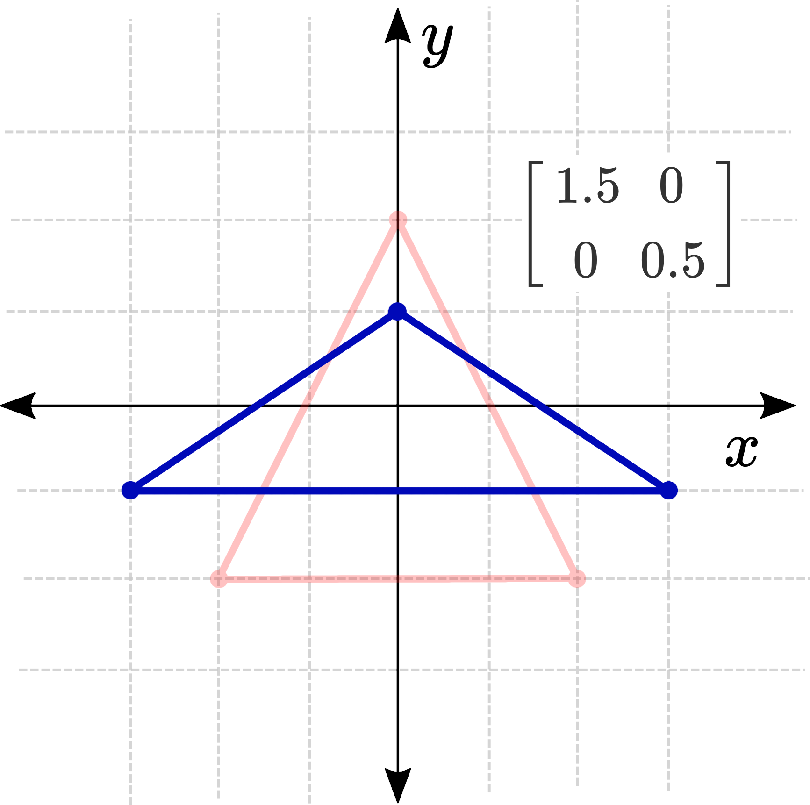
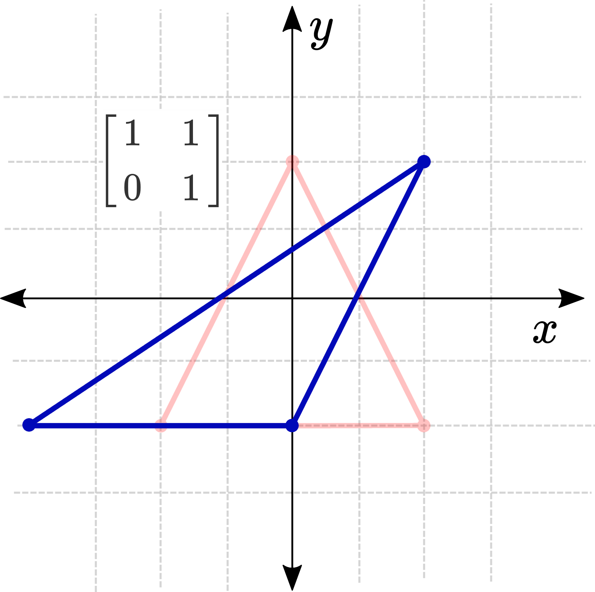

# Tutorial 1: Lineær vs. ikke-lineær transformation
Det er vigtigt at forstå, at vi kan opdele alle transformationer i to adskilte kategorier: lineære og ikke-lineære. Vi vil senere tale mere detaljeret om, hvad linearitet betyder, men for nu er det eneste, vi behøver at vide er, at lineære funktioner er funktioner af formen:

$$
f(\mathbf{p})=\mathbf{A} \mathbf{p}
$$

Hvor $\mathbf{A}$ er en $n \times n$ matrix, og $n$ er antallet af dimensioner i $\mathbf{p}$. Så $\mathbf{A}$-matricen for henholdsvis 1D-, 2D- og 3D-tilfældene ville se sådan ud:

$$
[a],\left[\begin{array}{ll}
a & b \\
c & d
\end{array}\right],\left[\begin{array}{lll}
a & b & c \\
d & e & f \\
g & h & i
\end{array}\right]
$$

Hvis funktionen er noget andet end en matrix multipliceret med inputtet, så er den ikke-lineær. Og selvom dette kan virke som en ret stor begrænsning (som vi dog vil vende tilbage til senere i kurset), kan vi stadig udføre nogle imponerende transformationer, og forståelsen af, hvordan man bruger dem, vil forberede os godt på at forstå ikke-lineariteter senere hen.

En hurtig advarsel: lad dig ikke narre til at tro, at en funktion som $y=m x+b$ er lineær, bare fordi den er en linje. At være lineær i polynomiel forstand er ikke det samme som at være en lineær funktion/transformation, og denne specifikke funktion er ikke-lineær på grund af det tilføjede $b$-led.

## Lineære transformationer
En **lineær** transformation er en funktion, der modtager en vektor som input og returnerer en ny vektor. Det, der kendetegner en lineær transformation, er, at den opfylder to grundlæggende betingelser:

- **Additivitet:**  
  $F(a + b) = F(a) + F(b)$  
  Det betyder, at hvis vi lægger to vektorer sammen og derefter transformerer summen, vil resultatet være det samme som at transformere hver vektor for sig og derefter lægge de transformerede vektorer sammen.

- **Homogenitet (Skalering):**  
  $F(k \cdot a) = k \cdot F(a)$  
  Det indebærer, at hvis vi først skalerer en vektor med en konstant $k$ og derefter transformerer den, bliver resultatet det samme som at transformere vektoren og derefter skalere resultatet med $k$.

En vigtig konsekvens af disse egenskaber er, at lineære transformationer ikke inkluderer translation, da en sådan forskydning ville overtræde betingelsen for homogenitet.

Lad os udforske denne idé lidt mere ved at bruge eksemplet på en 2D lineær transformation. Vi vil se på, hvordan hvert af disse fire matrixelementer ($a, b, c$, og $d$) vil påvirke vores transformations adfærd.

$$
\begin{aligned}
\mathbf{p}_2 & =\mathbf{A} \mathbf{p}_1 \\
{\left[\begin{array}{l}
x_2 \\
y_2
\end{array}\right] } & =\left[\begin{array}{ll}
a & b \\
c & d
\end{array}\right]\left[\begin{array}{l}
x_1 \\
y_1
\end{array}\right] \\
& =\left[\begin{array}{l}
a x_1+b y_1 \\
c x_1+d y_1
\end{array}\right]
\end{aligned}
$$

### Identitetstransformationen
Den første og simpleste matrix, vi vil se på, er identitetsmatricen (dvs. $a$ og $d$ er $1$, mens $b$ og $c$ er $0$). Når vi multiplicerer en hvilken som helst vektor med identitetsmatricen, får vi den samme vektor ud – så denne transformation gør ingenting! Dette vil være vores udgangspunkt for at se på de andre transformationer.

$$
\begin{aligned}
{\left[\begin{array}{l}
x_2 \\
y_2
\end{array}\right] } & =\left[\begin{array}{ll}
1 & 0 \\
0 & 1
\end{array}\right]\left[\begin{array}{l}
x_1 \\
y_1
\end{array}\right] \\
& =\left[\begin{array}{l}
x_1 \\
y_1
\end{array}\right]
\end{aligned}
$$

### Skalering  
Elementet $a$ bestemmer, hvor meget $x_1$ påvirker $x_2$, og elementet $d$ bestemmer, hvor meget $y_1$ påvirker $y_2$. Hvis vi kun ændrer disse værdier, vil det resultere i en skalering langs $x$- eller $y$-aksen (eller begge). At reducere begge disse til nul er et særligt tilfælde, hvor hvert enkelt punkt skrumper sammen til origo!

$$
\begin{aligned}
{\left[\begin{array}{l}
x_2 \\
y_2
\end{array}\right] } & =\left[\begin{array}{ll}
a & 0 \\
0 & d
\end{array}\right]\left[\begin{array}{l}
x_1 \\
y_1
\end{array}\right] \\
& =\left[\begin{array}{l}
a x_1 \\
d y_1
\end{array}\right]
\end{aligned}
$$

{: style="width:300px; display:block; margin:0 auto;"}

### Shearing (Skævning)  
De to ikke-diagonale elementer styrer skævningstransformationen. Elementet $b$ bestemmer, hvor meget den gamle $y$ påvirker den nye $x$, og elementet $c$ bestemmer, hvor meget den gamle $x$ påvirker den nye $y$. Ved at holde $a$ og $d$ lig med 1 og justere disse ét ad gangen opnås en skæv/skæv effekt.

$$
\begin{aligned}
{\left[\begin{array}{l}
x_2 \\
y_2
\end{array}\right] } & =\left[\begin{array}{ll}
1 & b \\
c & 1
\end{array}\right]\left[\begin{array}{l}
x_1 \\
y_1
\end{array}\right] \\
& =\left[\begin{array}{l}
x_1+b y_1 \\
y_1+c x_1
\end{array}\right]
\end{aligned}
$$

{: style="width:300px; display:block; margin:0 auto;"}

### Kombinationer  
At kombinere disse giver os mulighed for at opnå nogle andre interessante effekter. For eksempel, hvis vi bruger matricen $\left[\begin{array}{ll}0 & 1 \\ 1 & 0\end{array}\right]$, siger vi, at den nye $x$ kun påvirkes af den gamle $y$ og omvendt. Dette resulterer i et spejlbillede af alle punkterne på tværs af linjen $y=x$.

Egenskaber ved lineære transformationer

Så hvorfor bryder vi os så meget om lineære transformationer? Alle lineære transformationer har nemlig en række nyttige fælles egenskaber, som gør dem langt mere behagelige at arbejde med sammenlignet med ikke-lineære funktioner. Her er et par stykker:
- 0 afbildes altid til 0. Der er ingen måde at flytte origo på.
- Lineære transformationer er altid ulige $(f(-\mathbf{p})=-f(\mathbf{p}))$. Dette resulterer i en slags spejleffekt. Hvis du vælger et vilkårligt punkt og ser, hvordan det bevæger sig, vil punktet direkte modsat (gennem origo) bevæge sig i den modsatte retning og fortsat være dets spejlbillede. Du kan forestille dig, at der er en nål gennem origo, og at alt strækkes og spejles omkring den.
- Lineære transformationer kædes sammen ved multiplikation. Hvis vi ønsker at skalere nogle punkter, derefter skæve dem, og til sidst rotere dem, skal vi blot multiplicere alle matricerne sammen:

$$
f_3\left(f_2\left(f_1(\mathbf{p})\right)\right)=\mathbf{A}_3 \mathbf{A}_2 \mathbf{A}_1 \mathbf{p}
$$

Denne sidste egenskab er ekstremt hjælpsom. Det gør ikke kun ligningerne enklere på papiret, men forbedrer også beregningshastigheden, da vi kan formultiplicere matricerne efter behov og derefter transformere de nødvendige punkter med en enkelt endelig multiplikation. Og nu videre til [tutorial 2](../04_Matricer_og_linear_transformationer/T2.md)
