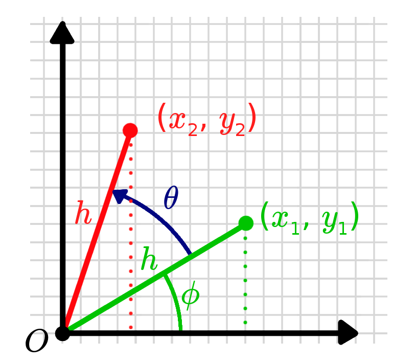

# Tutorial 2: Rotationer i 2D
I tutorial 1 så vi, at vi kan bruge matricer til at udføre forskellige typer af transformationer på punkter i rummet. Vi kan strække, spejle og skalere dem, men det vigtige for os er rotation. Robotter ændrer ikke pludselig deres størrelse, og de spejler sig bestemt ikke langs en akse, men én ting de gør ret ofte er at rotere. Derfor er det vigtigt, at vi har en solid matematisk forståelse af rotationen af punkter i rummet.

## Udledning af rotationsmatricen

Lad os antage, at vi har et punkt $\left(x_1, y_1\right)$, og at vi ønsker at finde den $2 \times 2$ transformationsmatrix, der roterer det (mod uret) omkring origo med en vinkel $\theta$ til et nyt punkt, $\left(x_2, y_2\right)$.

{: style="width:300px; display:block; margin:0 auto;"}

Med andre ord leder vi efter værdier, der opfylder en ligning, der ligner denne:

$$
\left[\begin{array}{l}
x_2 \\
y_2
\end{array}\right]=\left[\begin{array}{ll}
a & b \\
c & d
\end{array}\right]\left[\begin{array}{l}
x_1 \\
y_1
\end{array}\right]=\left[\begin{array}{l}
a x_1+b y_1 \\
c x_1+d y_1
\end{array}\right]
$$

For at forstå problemet begynder vi med at tilføje nogle ekstra variable for at gøre det nemmere. Vi introducerer $h$, afstanden fra punktet til origo (hypotenusen i den trekant, der dannes af $(0,0)$, $\left(x_1, 0\right)$ og $\left(0, y_1\right)$), samt $\phi$, vinklen som hypotenusen danner med $x$-aksen.

{: style="width:300px; display:block; margin:0 auto;"}

Vi kan nu udtrykke $x_1$ og $y_1$ på følgende måde:

$$
\left[\begin{array}{l}
x_1 \\
y_1
\end{array}\right]=\left[\begin{array}{l}
h \cos (\phi) \\
h \sin (\phi)
\end{array}\right]
$$

Vi kan udtrykke det nye, roterede punkt på samme måde. Det skal være på samme afstand fra origo, $h$, men med en ny vinkel, $(\phi+\theta)$. Ved at bruge nogle trigonometriske identiteter kan vi erstatte vores oprindelige punkter:

$$
\begin{aligned}
{\left[\begin{array}{l}
x_2 \\
y_2
\end{array}\right] } & =\left[\begin{array}{l}
h \cos (\phi+\theta) \\
h \sin (\phi+\theta)
\end{array}\right] \\
& =\left[\begin{array}{l}
h \cos (\phi) \cos (\theta)-h \sin (\phi) \sin (\theta) \\
h \sin (\phi) \cos (\theta)+h \cos (\phi) \sin (\theta)
\end{array}\right] \\
& =\left[\begin{array}{l}
x_1 \cos (\theta)-y_1 \sin (\theta) \\
x_1 \sin (\theta)+y_1 \cos (\theta)
\end{array}\right]
\end{aligned}
$$

Vi kan nu udtrække koefficienterne og udtrykke dette som en matrix multipliceret med det oprindelige punkt:

$$
\left[\begin{array}{l}
x_2 \\
y_2
\end{array}\right]=\left[\begin{array}{cc}
\cos (\theta) & -\sin (\theta) \\
\sin (\theta) & \cos (\theta)
\end{array}\right]\left[\begin{array}{l}
x_1 \\
y_1
\end{array}\right]
$$

Og det er det! Denne $2 \times 2$ matrix er rotationsmatricen i 2D. Du kan multiplicere den med ethvert punkt (eller en række punkter) for at rotere dem mod uret omkring origo med vinklen $\theta$. Hvis du vil se nogle eksempler, kan du scrolle ned til bunden af siden. Men først vil vi se nærmere på tre vigtige egenskaber, som en rotationsmatrix har.

## Egenskaber ved rotationsmatricer  
Rotationsmatricer har en række vigtige egenskaber, der gør dem virkelig nyttige. De kan virke lidt trivielle til at begynde med, men efterhånden som vi arbejder med mere komplekse ligninger og mange matricer, vil de spare os for en masse hovedpine!

### Invers = Transponeret  
Den første egenskab, man skal være opmærksom på, er, at inversen af en rotationsmatrix er dens transponerede. Nogle gange kan det at beregne en matrices inverse være en ret vanskelig (eller endda umulig) opgave, men med rotationsmatricer bliver det meget ligetil.

Der er faktisk en ret simpel måde at forstå dette forhold på. Forestil dig, at vi har et punkt $\left(x_2, y_2\right)$, som vi har opnået ved at rotere et punkt $\left(x_1, y_1\right)$ med en vinkel $\theta$. Hvis vi ønsker at vende denne transformation, svarer det til at "afrotere" punktet, eller med andre ord rotere det med en vinkel $-\theta$.

$$
\begin{aligned}
R(\theta)^{-1} & =\left[\begin{array}{cc}
\cos (\theta) & -\sin (\theta) \\
\sin (\theta) & \cos (\theta)
\end{array}\right]^{-1} \\
& =\left[\begin{array}{cc}
\cos (-\theta) & -\sin (-\theta) \\
\sin (-\theta) & \cos (-\theta)
\end{array}\right]
\end{aligned}
$$

Ved at udnytte, at cosinusfunktionen er lige $(\cos (-\theta)=\cos (\theta))$ og sinusfunktionen er ulige $(\sin (-\theta)=-\sin (\theta))$, kan resultatet let bevises:

$$
\begin{aligned}
R(\theta)^{-1} & =\left[\begin{array}{cc}
\cos (-\theta) & -\sin (-\theta) \\
\sin (-\theta) & \cos (-\theta)
\end{array}\right] \\
& =\left[\begin{array}{cc}
\cos (\theta) & \sin (\theta) \\
-\sin (\theta) & \cos (\theta)
\end{array}\right]^T \\
& =\left[\begin{array}{cc}
\cos (\theta) & -\sin (\theta) \\
\sin (\theta) & \cos (\theta)
\end{array}\right]^T \\
& =R(\theta)^T
\end{aligned}
$$

### Determinant = 1

Den anden egenskab er, at determinanten for alle rotationsmatricer er lig med 1, uanset hvilken værdi $\theta$ har. Igen er det ret ligetil at bevise ved at bruge formlen for determinanten af en 2D-matrix og nogle standard trigonometriske identiteter.

$$
\operatorname{det}\left(\left[\begin{array}{ll}
a & b \\
c & d
\end{array}\right]\right)=a d - b c
$$

Hvis vi erstatter med værdierne fra vores rotationsmatrix, får vi:

$$
\begin{aligned}
\operatorname{det}(R(\theta)) & =\operatorname{det}\left(\left[\begin{array}{cc}
\cos (\theta) & -\sin (\theta) \\
\sin (\theta) & \cos (\theta)
\end{array}\right]\right) \\
& = (\cos (\theta) \cos (\theta)) - (-\sin (\theta) \sin (\theta)) \\
& = \cos^2(\theta) + \sin^2(\theta) \\
& = 1
\end{aligned}
$$

### Rotation x Rotation = Rotation (!)
Rotation matrices have the property that if you multiple two of them together, you always get another rotation matrix. That is, you get another matrix that has the same properties as above and which would represent a different rotation in space (for the 2D case it will be the sum of the two angles of the original, but in 3D it will get more interesting).

{: style="width:300px; display:block; margin:0 auto;"}

Vi kan igen bevise dette ret nemt med trigonometriske identiteter.

\begin{aligned}
&\begin{aligned}
R(\alpha) R(\theta) & =\left[\begin{array}{cc}
\cos (\alpha) & -\sin (\alpha) \\
\sin (\alpha) & \cos (\alpha)
\end{array}\right] \times\left[\begin{array}{cc}
\cos (\theta) & -\sin (\theta) \\
\sin (\theta) & \cos (\theta)
\end{array}\right] \\
& =\left[\begin{array}{cc}
\cos (\alpha) \cos (\theta)-\sin (\alpha) \sin (\theta) & -\cos (\alpha) \sin (\theta)-\sin (\alpha) \cos (\theta) \\
\sin (\alpha) \cos (\theta)+\cos (\alpha) \sin (\theta) & -\sin (\alpha) \sin (\theta)+\cos (\alpha) \cos (\theta)
\end{array}\right] \\
& =\left[\begin{array}{cc}
\cos (\alpha+\theta) & -\sin (\alpha+\theta) \\
\sin (\alpha+\theta) & \cos (\alpha+\theta)
\end{array}\right] \\
& =R(\alpha+\theta)
\end{aligned}
\end{aligned}

### Næste stop?
Nu hvor vi har styr på matematikken bag 2D-rotationer, kan vi begynde at arbejde med 3D – et vigtigt emne, da vores objekter i 3D grafik alle opererer i en 3D-verden (selvom nogle beregninger kan forenkles til 2D). Det andet spørgsmål, vi endnu ikke har besvaret, er, hvordan vi kan oversætte (flytte) vores objekter, da det ikke er særligt brugbart at sidde fast på ét sted og rotere dem om origo. Dette vil vi se nærmere på i næste uge. Men kig på [tutorial 3](../04_Matricer_og_linear_transformationer/T3.md).

Ellers kan I jo lege lidt med denne rotation og så hvordan matricerne udvikler sig (bruger skyderen).

