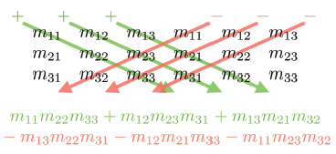

# Tutorial 1: Beregning af determinanter og inverser

## Determinanter
En determinant er en speciel skalarværdi, der kan beregnes for **kvadratiske matricer**, dvs. $n \times n$ matricer. Determinanten af en matrix $\mathbf{M}$ betegnes som $|\mathbf{M}|$ eller "det $\mathbf{M}$".

**Determinanter af 2×2 matricer:**

For en 2×2 matrix er determinanten givet ved formlen:

$$
|\mathbf{M}| = \begin{vmatrix} m_{11} & m_{12} \\ m_{21} & m_{22} \end{vmatrix} = m_{11}m_{22} - m_{12}m_{21}
$$

 * Du kan visualisere dette ved at multiplicere elementerne langs diagonalen og "anti-diagonalen" og derefter trække "anti-diagonalen" fra diagonalen.
 *   **Eksempel:** $\begin{vmatrix} 2 & 1 \\ -1 & 2 \end{vmatrix} = (2)(2) - (1)(-1) = 5$

**Determinanter af 3×3 matricer:**

For en 3×3 matrix er determinanten givet ved en mere kompleks formel:

$$
\begin{vmatrix} m_{11} & m_{12} & m_{13} \\ m_{21} & m_{22} & m_{23} \\ m_{31} & m_{32} & m_{33} \end{vmatrix} = m_{11}m_{22}m_{33} + m_{12}m_{23}m_{31} + m_{13}m_{21}m_{32} - m_{13}m_{22}m_{31} - m_{12}m_{21}m_{33} - m_{11}m_{23}m_{32}
$$

 *   Denne formel kan også visualiseres med et diagram ved at skrive to kopier af matricen ved siden af hinanden og multiplicere langs diagonalerne
  

    { width=300 }


### Underdeterminant og kofaktorer

 * En **underdeterminant** eller **minor** ($\mathbf{M}\{ij\}$) er determinanten af den matrix, der opnås ved at fjerne række $i$ og kolonne $j$ fra den oprindelige matrix.
 * En **kofaktor** ($C\{ij\}$) er en underdeterminant med et fortegn, der afhænger af positionen: $C\{ij\} = (-1)^{i+j}\mathbf{M}\{ij\}$. Fortegnene danner et skakternet mønster:

$$
\left[\begin{array}{ccccc}
+ & - & + & - & \cdots \\
- & + & - & + & \cdots \\
+ & - & + & - & \cdots \\
- & + & - & + & \cdots \\
\vdots & \vdots & \vdots & \vdots & \ddots
\end{array}\right]
$$

**Eksempel:**
        
$\mathbf{M}=\left[\begin{array}{ccc}
-4 & -3 & 3 \\
0 & 2 & -2 \\
1 & 4 & -1
\end{array}\right]$

$$
\begin{aligned}
& C^{\{11\}}=+\left|\begin{array}{cc}
2 & -2 \\
4 & -1
\end{array}\right|=6, \quad C^{\{12\}}=-\left|\begin{array}{cc}
0 & -2 \\
1 & -1
\end{array}\right|=-2, \quad C^{\{13\}}=+\left|\begin{array}{cc}
0 & 2 \\
1 & 4
\end{array}\right|=-2, \\
& C^{\{21\}}=-\left|\begin{array}{cc}
-3 & 3 \\
4 & -1
\end{array}\right|=9, \quad C^{\{22\}}=+\left|\begin{array}{cc}
-4 & 3 \\
1 & -1
\end{array}\right|=1, \quad C^{\{23\}}=-\left|\begin{array}{cc}
-4 & -3 \\
1 & 4
\end{array}\right|=13, \\
& C^{\{31\}}=+\left|\begin{array}{cc}
-3 & 3 \\
2 & -2
\end{array}\right|=0, \quad C^{\{32\}}=-\left|\begin{array}{cc}
-4 & 3 \\
0 & -2
\end{array}\right|=-8, \quad C^{\{33\}}=+\left|\begin{array}{cc}
-4 & -3 \\
0 & 2
\end{array}\right|=-8 .
\end{aligned}
$$

### Determinanter af n×n matricer:
Determinanten af en $n \times n$ matrix kan beregnes rekursivt ved hjælp af kofaktorer:

$$
|\mathbf{M}| = \sum_{j=1}^{n} m_{ij}C\{ij\} = \sum_{j=1}^{n} m_{ij}(-1)^{i+j}\mathbf{M}\{ij\}
$$

 *   Du kan vælge en hvilken som helst række eller kolonne at udvide langs.

### Egenskaber af determinanter:
 * $|I| = 1$, hvor $I$ er identitetsmatricen.
 * $|AB| = |A||B|$.
 * $|\mathbf{M}^T| = |\mathbf{M}|$.
 * Hvis en række eller kolonne indeholder kun nuller, er determinanten 0.
 * Ombytning af to rækker ændrer fortegnet på determinanten.
 * Tilføjelse af en multipel af en række til en anden ændrer ikke determinanten.
 * **Geometrisk fortolkning:** I 2D er determinanten lig med det **signerede areal** af parallelogrammet, der dannes af basisvektorerne. I 3D er det **volumenet** af det parallellepipedum, der dannes af basisvektorerne. Fortegnet indikerer, om der er en refleksion.
* **Klassificering af transformationer:** Hvis determinanten er nul, indeholder matricen en projektion. Hvis determinanten er negativ, indeholder matricen en refleksion.


### 💻 Determinanter i Python
```python	
import numpy as np
A = np.array([[-4,-3,3],
              [0,2,-2],
              [1,4,-1]])

# Beregn determinanten
det_A = np.linalg.det(A)
```

## Den inverse

Inversen af en kvadratisk matrix $\mathbf{M}$, betegnet $\mathbf{M}^{-1}$, er den matrix, der opfylder $\mathbf{M}(\mathbf{M}^{-1}) = \mathbf{M}^{-1}\mathbf{M} = I$, hvor $I$ er identitetsmatricen.

*   **Invertible vs. singulære matricer:**
    *   En matrix, der har en invers, kaldes **invertibel** eller **nonsingulær**.
    *   En matrix, der ikke har en invers, kaldes **ikke-invertibel** eller **singulær**.
    *   Determinanten af en singulær matrix er nul.
*   **Beregning af inversen ved hjælp af den klassiske adjungerede:**
    *   Den **klassiske adjungerede** (adj $\mathbf{M}$) er transponeringen af matrixen af kofaktorer.
    *   Inversen beregnes som: $\mathbf{M}^{-1} = \frac{\text{adj } \mathbf{M}}{|\mathbf{M}|}$.

        $$
        \operatorname{adj} \mathbf{M}=\left[\begin{array}{lll}
        C^{\{11\}} & C^{\{12\}} & C^{\{13\}} \\
        C^{\{21\}} & C^{\{22\}} & C^{\{23\}} \\
        C^{\{31\}} & C^{\{32\}} & C^{\{33\}}
        \end{array}\right]^{\mathrm{T}}
        $$

    *   **Eksempel (fortsat fra ovenfor):**
        
        $$
        \begin{aligned}
        \operatorname{adj} \mathbf{M} & =\left[\begin{array}{lll}
        C^{\{11\}} & C^{\{12\}} & C^{\{13\}} \\
        C^{\{21\}} & C^{\{22\}} & C^{\{23\}} \\
        C^{\{31\}} & C^{\{32\}} & C^{\{33\}}
        \end{array}\right]^{\mathrm{T}} \\
        & =\left[\begin{array}{ccc}
        6 & -2 & -2 \\
        9 & 1 & 13 \\
        0 & -8 & -8
        \end{array}\right]^{\mathrm{T}}=\left[\begin{array}{ccc}
        6 & 9 & 0 \\
        -2 & 1 & -8 \\
        -2 & 13 & -8
        \end{array}\right] .
        \end{aligned}
        $$


*   **Egenskaber af inversen:**
    *   $(\mathbf{M}^{-1})^{-1} = \mathbf{M}$.
    *   $I^{-1} = I$.
    *   $(\mathbf{M}^T)^{-1} = (\mathbf{M}^{-1})^T$.
    *   $(AB)^{-1} = B^{-1}A^{-1}$.
    *   $|\mathbf{M}^{-1}| = \frac{1}{|\mathbf{M}|}$.
*   **Geometrisk fortolkning:** Inversen "fortryder" transformationen af den oprindelige matrix.

### 💻 Inversen i Python
Python har ikke en indbygget funktion til at beregne den klassiske adjungerede, men vi kan skrive vores egen funktion til at beregne den adjungerede og derefter bruge determinanten til at beregne inversen.

```python	
import numpy as np

# Definer matrix A
A = np.array([[-4, -3, 3],
              [0, 2, -2],
              [1, 4, -1]])

# Beregn kofaktormatricen
cofactor_matrix = np.zeros((3,3))  # Initialiser en tom matrix
for i in range(3):
    for j in range(3):
        # Minor: Fjern række i og søjle j
        minor = np.delete(np.delete(A, i, axis=0), j, axis=1)
        # Beregn determinant af minormatrixen og multiplicer med fortegnet (-1)^(i+j)
        cofactor_matrix[i, j] = ((-1) ** (i + j)) * np.linalg.det(minor)

# Beregn den adjungerede matrix (transponering af kofaktormatricen)
adjugate_A = cofactor_matrix.T

# Beregn determinanten
det_A = np.linalg.det(A)

# Beregn den inverse matrix
if det_A != 0:
    inverse_A = adjugate_A / det_A
else:
    inverse_A = "Matrixen er singulær og har ingen invers"

# Udskriv resultaterne
print("Matrix A:\n", A)
print("\nDeterminant:", round(det_A, 2))
print("\nKofaktormatrix:\n", cofactor_matrix)
print("\nAdjungerede matrix (adjugate):\n", adjugate_A)
print("\nInverse matrix:\n", inverse_A)
```

Vi kan også bruge NumPy-funktionen `np.linalg.inv()` til at beregne inversen direkte:

```python
import numpy as np
A = np.array([[-4,-3,3],
              [0,2,-2],
              [1,4,-1]])

# Beregn inversen
A_inv = np.linalg.inv(A)
```