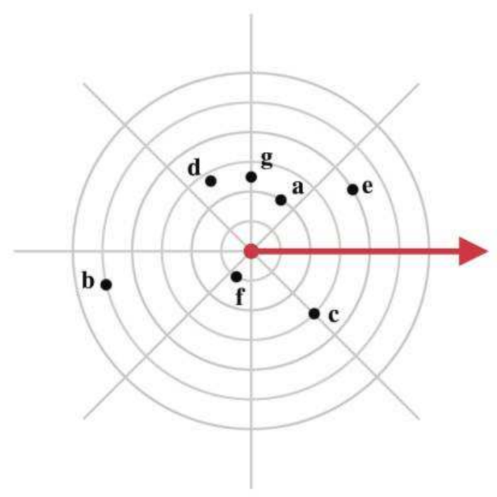

<h1 align="center">Polære koordinater</h1>

## Forberedelse
3DM: [Kapitel 7]()

I skal have set [videoerne](#videomateriale) fra den aktuelle session. Dette udgør som minimum jeres forberedelse til hver session. Hertil kan I også læse i bogen.

## Materiale

[Sessionsmateriale]()

[Øvelsesnoter - tilgængelige mandag]()

---

## Kort om sessionen

### Nøgleord

---

## Videomateriale

---

## Øvelser

---

**Øvelse 1**

??? answer "Se svaret"

    

---

**Øvelse 2** <!-- Exercise 1 -->

Plot and label the points with the following polar coordinates:

$$
\begin{aligned}
&\begin{array}{ll}
\mathbf{a}=\left(2,60^{\circ}\right) & \mathbf{b}=\left(5,195^{\circ}\right) \\
\mathbf{c}=\left(3,-45^{\circ}\right) & \mathbf{d}=\left(-2.75,300^{\circ}\right) \\
\mathbf{e}=(4, \pi / 6 \mathrm{rad}) & \mathbf{f}=(1,4 \pi / 3 \mathrm{rad}) \\
\mathbf{g}=(-5 / 2,-\pi / 2 \mathrm{rad}) &
\end{array}
\end{aligned}
$$

??? answer "Se svaret"
    
    

---

**Øvelse 3** <!-- Exercise 2 a) d) -->

Convert the following 2D polar coordinates to canonical form:

1. $\left(4,207^{\circ}\right)$
2. $(12.6,11 \pi / 4 \mathrm{rad})$

??? answer "Se svaret"
    1. $\left(4,207^{\circ}\right) \equiv\left(4,207^{\circ}-360^{\circ}\right) \equiv\left(4,-153^{\circ}\right)$
    2. $(12.6,11 \pi / 4 \mathrm{rad}) \equiv(12.6,11 \pi / 4 \mathrm{rad}-2 \pi \mathrm{rad}) \equiv(12.6,3 \pi / 4 \mathrm{rad})$

---

**Øvelse 4** <!-- Exercise 3 a) c) e) -->

Convert the following 2D polar coordinates to Cartesian form:

1. $\left(1,45^{\circ}\right)$
2. $\left(4,90^{\circ}\right)$
3. $(5.5, \pi \mathrm{rad})$

??? answer "Se svaret"
    1. $\left(1,45^{\circ}\right)_p \equiv\left(1 \cos 45^{\circ}, 1 \sin 45^{\circ}\right)_c \approx(1 \cdot 0.707,1 \cdot 0.707)_c=(0.707,0.707)_c$
    2. $\left(4,90^{\circ}\right)_p \equiv\left(4 \cos 90^{\circ}, 4 \sin 90^{\circ}\right)_c=(4 \cdot 0,4 \cdot 1)_c=(0,4)_c$
    3. $(5.5, \pi \mathrm{rad})_p \equiv(5.5 \cos (\pi \mathrm{rad}), 5.5 \sin (\pi \mathrm{rad}))_c=(5.5 \cdot(-1), 5.5 \cdot(0))_c=(-5.5,0)_c$

---

**Øvelse 5** <!-- Exercise 5 a) c) e) -->

Convert the following 2D Cartesian coordinates to (canonical) polar form:

1. $(10,20)$
2. $(0,4.5)$
3. $(0,0)$

??? answer "Se svaret"
    1. $(10,20)_c$ :

        $$
        \begin{aligned}
        r & =\sqrt{10^2+20^2}=\sqrt{100+400}=\sqrt{500} \approx 22.36 \\
        \theta & =\operatorname{atan} 2(20,10)=\arctan (20 / 10) \approx 63.43^{\circ} \\
        (10,20)_c & \cong\left(22.36,63.43^{\circ}\right)_p
        \end{aligned}
        $$

    2. $(0,4.5)_c$ :

        $$
        \begin{aligned}
        r & =\sqrt{0^2+4.5^2}=4.5 \\
        \theta & =\operatorname{atan} 2(0,4.5)=90^{\circ} \\
        (4.5,0)_c & \equiv\left(4.5,90^{\circ}\right)_p
        \end{aligned}
        $$

    3. $(0,0)_c \equiv(0,0)_p$

---

**Øvelse 6** <!-- Exercise 6 a) d) -->

Convert the following cylindrical coordinates to Cartesian form:

1. $\left(4,120^{\circ}, 5\right)$
2. $(3,3 \pi, 1)$

??? answer "Se svaret"
    1. 
    
        $$
        \begin{aligned}
        & x=r \cos (\theta)=4 \cos \left(120^{\circ}\right)=4(-1 / 2)=-2 \\
        & y=r \sin (\theta)=4 \sin \left(120^{\circ}\right)=4(\sqrt{3} / 2)=2 \sqrt{3} \\
        & \text { so }(x, y, z)=(-2,2 \sqrt{3}, 5)
        \end{aligned}
        $$

    2. 

        $$
        \begin{aligned}
        & x=r \cos (\theta)=3 \cos (3 \pi)=3 \cos (\pi)=3(-1)=-3 \\
        & y=r \sin (\theta)=3 \sin (3 \pi)=3 \sin (\pi)=3(0)=0 \\
        & \text { so }(x, y, z)=(-3,0,1)
        \end{aligned}
        $$

---

**Øvelse 7** <!-- Exercise 7 a) d) -->

Convert the following 3D Cartesian coordinates to (canonical) cylindrical form:

1. $(1,1,1)$
2. $(0,0,-3)$

??? answer "Se svaret"
    1. 

        $$
        \begin{aligned}
        & r=\sqrt{1^2+1^2}=\sqrt{2} \\
        & \theta=\arctan (1 / 1)=45^{\circ} \\
        & \text { so }(r, \theta, z)=\left(\sqrt{2}, 45^{\circ}, 1\right)
        \end{aligned}
        $$

    2. 

        $$
        \begin{aligned}
        & r=\sqrt{0^2+0^2}=0 \\
        & \theta=0, \text { since } x=0 \text { and } y=0 \\
        & \text { so }(r, \theta, z)=(0,0,-3)
        \end{aligned}
        $$

---

**Øvelse 8** <!-- Exercise 8 a) d) -->

Convert the following spherical coordinates $(r, \theta, \phi)$ to Cartesian form according to the standard mathematical convention:

1. $(4, \pi / 3,3 \pi / 4)$
2. $(8,9 \pi / 4, \pi / 6)$

??? answer "Se svaret"
    1. 

        $$
        \begin{aligned}
        & x=r \sin (\phi) \cos (\theta)=4 \sin (3 \pi / 4) \cos (\pi / 3)=4(\sqrt{2} / 2)(1 / 2)=\sqrt{2} \\
        & y=r \sin (\phi) \sin (\theta)=4 \sin (3 \pi / 4) \sin (\pi / 3)=4(\sqrt{2} / 2)(\sqrt{3} / 2)=\sqrt{6} \\
        & z=r \cos (\phi)=4 \cos (3 \pi / 4)=4(-\sqrt{2} / 2)=-2 \sqrt{2} \\
        & \text { so }(x, y, z)=(\sqrt{2}, \sqrt{6},-2 \sqrt{2})
        \end{aligned}
        $$

    2. 

        $$
        \begin{aligned}
        & x=r \sin (\phi) \cos (\theta)=8 \sin (\pi / 6) \cos (9 \pi / 4)=8(1 / 2)(\sqrt{2} / 2)=2 \sqrt{2} \\
        & y=r \sin (\phi) \sin (\theta)=8 \sin (\pi / 6) \sin (9 \pi / 4)=8(1 / 2)(\sqrt{2} / 2)=2 \sqrt{2} \\
        & z=r \cos (\phi)=8 \cos (\pi / 6)=8(\sqrt{3} / 2)=4 \sqrt{3} \\
        & \text { so }(x, y, z)=(2 \sqrt{2}, 2 \sqrt{2}, 4 \sqrt{3})
        \end{aligned}
        $$

---

**Øvelse 9** <!-- Exercise 9 [only a) d)] -->

Interpret the spherical coordinates a) and b) from the previous exercise as $(r, h, p)$ triples, switching to our video game conventions.

1. Convert to canonical $(r, h, p)$ coordinates.
2. Use the canonical coordinates to convert to Cartesian form (using the video game conventions).

??? answer "Se svaret"
    1. 

        $$
        \begin{aligned}
        & \text { a) }(4, \pi / 3,3 \pi / 4) \Longrightarrow(4,4 \pi / 3, \pi / 4) \Longrightarrow(4,-2 \pi / 3, \pi / 4) \\
        & \\
        & \text { b) }(8,9 \pi / 4, \pi / 6) \Longrightarrow(8, \pi / 4, \pi / 6) \\        
        \end{aligned}
        $$

    2. 

        $$
        \begin{aligned}
        & \text { a) } \\
        & x=r \cos p \sin h=4 \cos (\pi / 4) \sin (-2 \pi / 3)=4(\sqrt{2} / 2)(-\sqrt{3} / 2)=-\sqrt{6} \\
        & y=-r \sin p=-4 \sin (\pi / 4)=-4(\sqrt{2} / 2)=-2 \sqrt{2} \\
        & z=r \cos p \cos h=4 \cos (\pi / 4) \cos (-2 \pi / 3)=4(\sqrt{2} / 2)(-1 / 2)=-\sqrt{2} \\
        & \text { so }(x, y, z)=(-\sqrt{6},-2 \sqrt{2},-\sqrt{2}) \\
        & \\
        & \text { b) } \\
        & x=r \cos p \sin h=8 \cos (\pi / 6) \sin (\pi / 4)=8(\sqrt{3} / 2)(\sqrt{2} / 2)=2 \sqrt{6} \\
        & y=-r \sin p=-8 \sin (\pi / 6)=-8(1 / 2)=-4 \\
        & z=r \cos p \cos h=8 \cos (\pi / 6) \cos (\pi / 4)=8(\sqrt{3} / 2)(\sqrt{2} / 2)=2 \sqrt{6} \\
        & \text { so }(x, y, z)=(2 \sqrt{6},-4,2 \sqrt{6})
        \end{aligned}
        $$

**Øvelse 10** <!-- Exercise 10 a) c) e) -->

Convert the following 3D Cartesian coordinates to (canonical) spherical form using our modified convention:

1. $(\sqrt{2}, 2 \sqrt{3},-\sqrt{2})$
2. $(-1,-1,-1)$
3. $(-\sqrt{3},-\sqrt{3}, 2 \sqrt{2})$

??? answer
    1. 

        $$
        \begin{aligned}
        & r=\sqrt{x^2+y^2+z^2}=\sqrt{(\sqrt{2})^2+(2 \sqrt{3})^2+(-\sqrt{2})^2=\sqrt{2+12+2}=\sqrt{16}=4} \\
        & h=\arctan (x / z)=\arctan (-\sqrt{2} / \sqrt{2})=\arctan (-1)=135^{\circ} \text {, given the location of } (x, z) \\
        & p=\arcsin (-y / r)=\arcsin (-(2 \sqrt{3}) / 4)=\arcsin (-\sqrt{3} / 2)=-60^{\circ} \\
        & \text { so }(r, h, p)=\left(4,135^{\circ},-60^{\circ}\right)
        \end{aligned}
        $$

    2. 

        $$
        \begin{aligned}
        & r=\sqrt{x^2+y^2+z^2}=\sqrt{(-1)^2+(-1)^2+(-1)^2}=\sqrt{1+1+1}=\sqrt{3} \\
        & h=\arctan (x / z)=\arctan ((-1) /(-1))=\arctan (1)=-135^{\circ} \text {, given the location of } (x, z) \\
        & p=\arcsin (-y / r)=\arcsin (1 / \sqrt{3})=35.26^{\circ} \\
        & \text { so }(r, h, p)=\left(\sqrt{3},-135^{\circ}, 35.26^{\circ}\right)
        \end{aligned}
        $$

    3. 

        $$
        \begin{aligned}
        & r=\sqrt{x^2+y^2+z^2}=\sqrt{(-\sqrt{3})^2+(-\sqrt{3})^2+(2 \sqrt{2})^2}=\sqrt{3+3+8}=\sqrt{14} \\
        & h=\arctan (x / z)=\arctan (-\sqrt{3} /(2 \sqrt{2}))=-31.48^{\circ}, \text { given the location of }(x, z) \\
        & p=\arcsin (-y / r)=\arcsin (\sqrt{3} / \sqrt{14})=27.58^{\circ} \\
        & \text { so }(r, h, p)=\left(\sqrt{14},-31.48^{\circ}, 27.58^{\circ}\right)
        \end{aligned}
        $$

## Uddybende noter